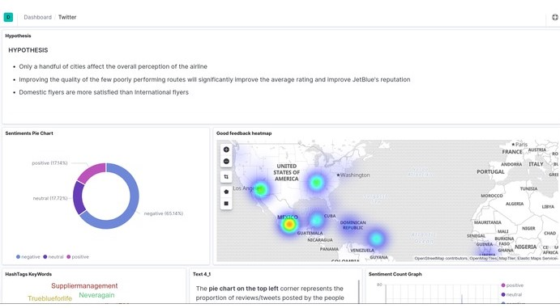
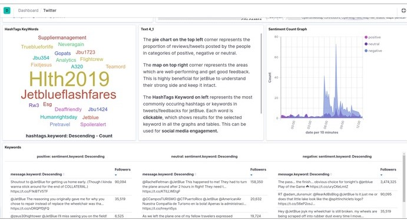
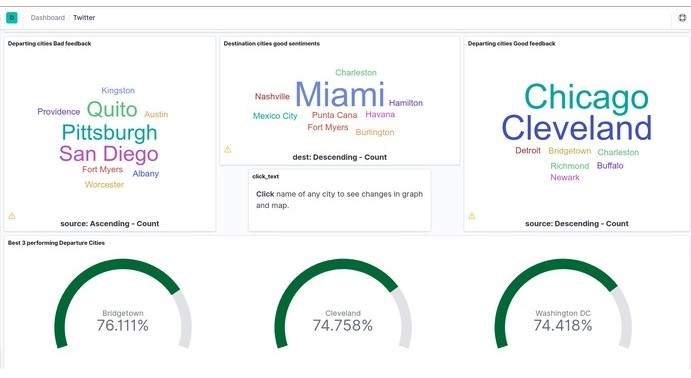
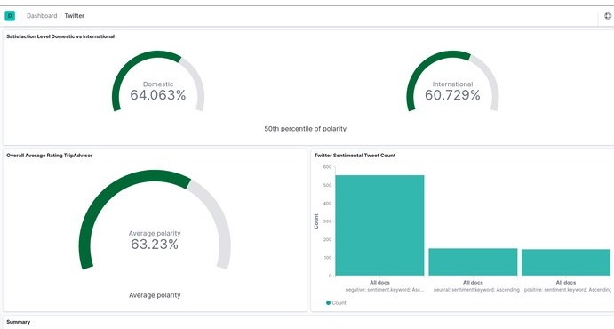
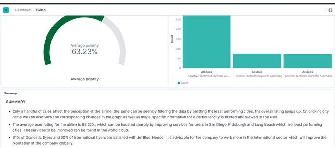

# ScrapeX
Our platform scrapes the data from multiple sources, filters extraneous anomalies, cleans the data, and then it runs sentimental analysis also while collecting important metadata and fields necessary for geotagging. It stores everything on elastic search instance for further processing in Kibana Dashboard.

The data is processed and displayed interactively using a bar graph, pie chart, heatmap, word map and dials, which makes visualising and viewing experience smoother.
The collected data is analyzed and categorized whether it is positive, negative or neutral. The hashtags used and most commonly occurring words are extracted and added to the world map. An extensive search can be made for reviews containing the words on the WordMap simply by clicking the word, and the changes are reflected in all the representations. The HashTags Keyword can represent the most commonly occurring hashtags or keywords in tweets/feedbacks for the airline, this can be used to track social media engagement too.

## Screenshots

Pie Chart representing neutral, positive, and negative tweets. Heat Map showing areas where company has been performing well.
 
 

WordMap on the left which can be clicked to filter results and Sentiment Count Graph
 

WordMaps for good and poor reviews. Dials representing best performing cities.
 

Domestic vs International Satisfaction Level
 

Average Rating, Twitter Sentiment Tweet Count
